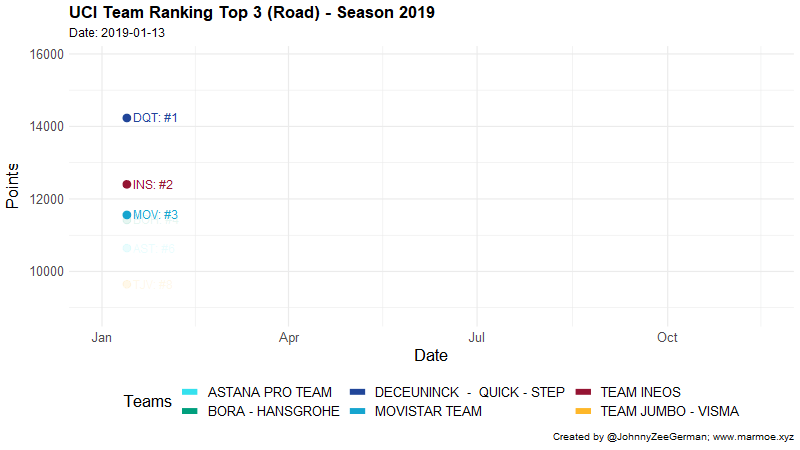
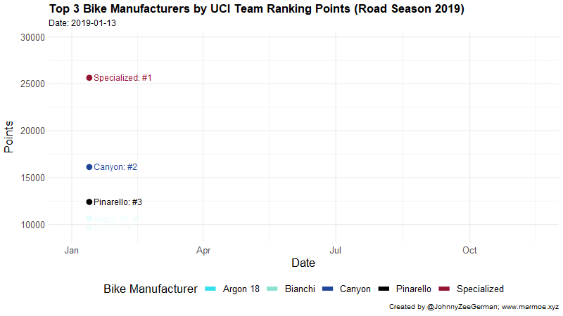

# UCI-Bike-Rankings
UCI Road Ranking points by team and road bike manufacturer for road cycling season 2019.

This repository contains the code required to produce the following two animations:

## Top 3 World Tour teams of 2019 based on weekly UCI Team Ranking points

* Final Ranking (23/10/2019):
  * Deceuninck-Quickstep 🥇
  * Bora-Hansgrohe 🥈
  * Team Jumbo Visma 🥉

## Top 3 World Tour teams of 2019 based on weekly UCI Team Ranking points

* Final Ranking (23/10/2019):
  * Specialized (28953.89) 🥇
  * Canyon (14423.05) 🥈
  * Bianchi (13042.65) 🥉
